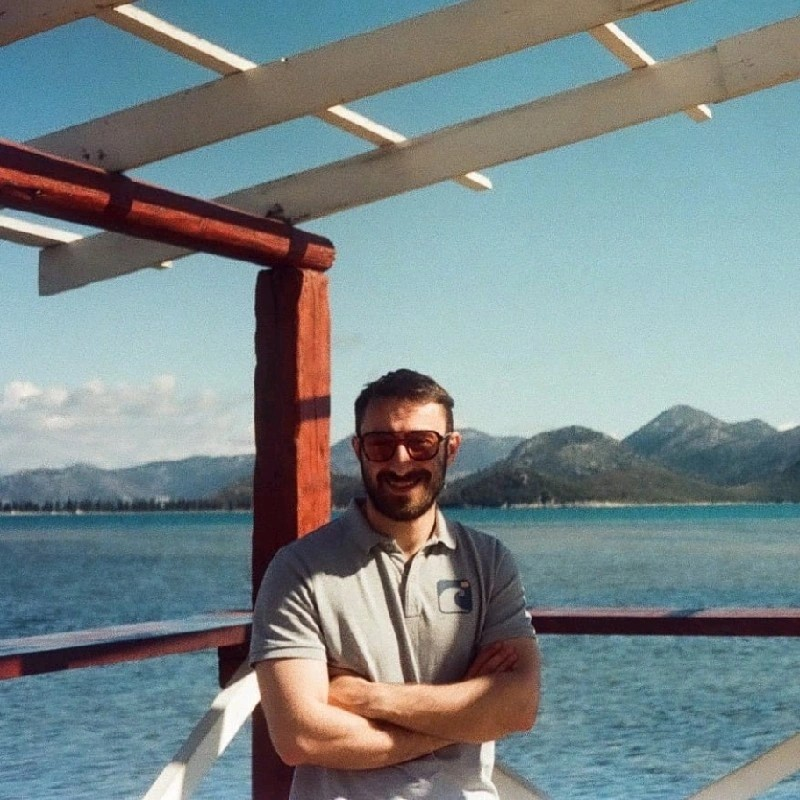

# Ivan Kokalović

  
  
<strong>Backend Developer</strong>

  
📍 Bremen, Germany

---

## About Me

Backend Developer at **RISE** (Research Industrial Systems Engineering) in Leipzig, working on infrastructure management, IAM systems, and backend development. I use Terragrunt, Java, Terraform, and Docker daily.

Before RISE, I spent over 4 years at **IDnow** in Munich and Leipzig, progressing from Ident Specialist through Fraud Prevention to Technical Services Engineer. I handled L3 support, built OCR engines, wrote Lambda functions, and worked with monitoring tools like Graylog and Grafana.

I also founded **In Voice d.o.o.** in Bosnia and Herzegovina - an IT consulting company where I built CRM systems, developed OCR solutions using Beowulf clusters, and worked on VoIP infrastructure.

Currently finishing my Information Technology degree at University of Mostar, focusing on databases and data science.

---

## Technical Skills

**Languages & Frameworks**

- Java, Python, Bash, PowerShell, JavaScript, C++, SQL

**Infrastructure & DevOps**

- Terragrunt, Terraform, Docker, Linux, CI/CD pipelines

**Monitoring & Tools**

- Graylog, Grafana, Jira, Confluence, MySQL

**Domain Knowledge**

- IAM systems, Fraud Prevention, AML, Technical Support, OCR/Document Processing

---

## Experience Timeline

| Period | Role | Company |
|--------|------|---------|
| 2025 - Present | Backend Developer | RISE, Leipzig |
| 2022 - 2025 | Technical Services Engineer | IDnow, Munich |
| 2021 - 2022 | Fraud Prevention Specialist | IDnow, Leipzig |
| 2021 | Ident Specialist | IDnow, Leipzig |
| 2019 - 2020 | CEO & Founder | In Voice d.o.o., Mostar |
| 2018 - 2019 | IT Consultant | Media One, Mostar |

---

## Languages

🇩🇪 German • 🇬🇧 English • 🇭🇷 Croatian • 🇷🇸 Serbian - *Fluent*
🇸🇮 Slovenian - *Working Proficiency* • 🇪🇸 Spanish - *Elementary*

---

## Links

- **[Full CV](cv.md)** - Complete work history and details
- **[Download PDF](download.md)** - Get CV in various formats
- **[Contact](contact.md)** - Get in touch
- **[LinkedIn](https://www.linkedin.com/in/kokalovic/)** - Professional profile
- **[GitHub](https://github.com/koke1997)** - Code and projects

---

*Last updated: January 2026*
